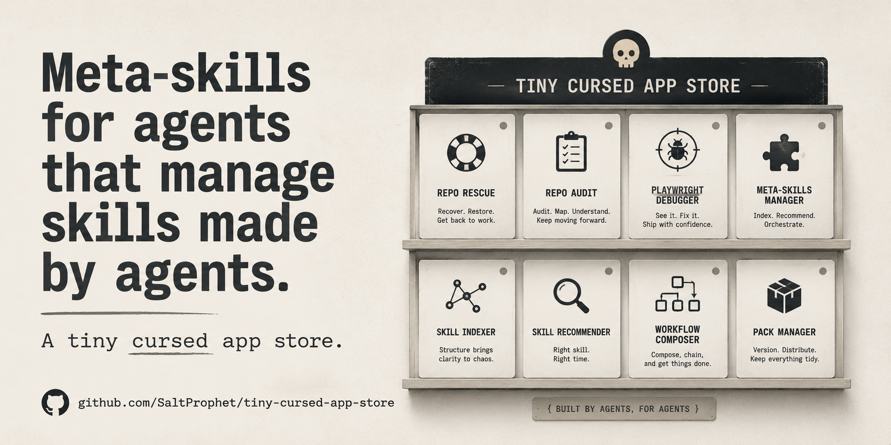

# Tiny Cursed App Store

**Meta-skills for agents that manage skills made by agents.**

A tiny app-store concept for agent-made tools, skill packs, and utility workflows.

## Core line

**Made by agents, for agents.**

## What this is

Tiny Cursed App Store is a concept artifact for packaging small agent tools and skill packs like a tiny utility shop instead of another sterile enterprise dashboard, because apparently every AI tool is legally required to look like a SaaS billing page now. Grim.

## Current cards

- **Repo Rescue** — recover, restore, get back to work.
- **Repo Audit** — audit, map, understand.
- **Playwright Debugger** — see it, fix it, ship with confidence.
- **Meta-Skills Manager** — index, recommend, orchestrate.
- **Skill Indexer** — structure brings clarity to chaos.
- **Skill Recommender** — right skill, right time.
- **Workflow Composer** — compose, chain, and get things done.
- **Pack Manager** — version, distribute, keep everything tidy.

## Visual direction

- handmade utility-shop feel
- muted colors
- readable card system
- small robot/agent mascot energy
- practical but slightly cursed
- no neon cyberpunk nonsense

## Secondary visual

## Status

Concept artifact / public proof packet.

## Not claimed

- Not a live marketplace
- Not paid client work
- Not production deployment
- Not external adoption proof

## Repository purpose

This repo exists as a public-facing proof artifact for agent-tool packaging, skill-pack concepts, and small utility workflow presentation.
